# Diseño de un sistema de procesamiento de señales para la mejora de la voz en pacientes post-cordectomía

**Integrantes del equipo:**

* Alfonso Gamboa Rubén
* Flores Montero Edsel Yetlanezi
* Gómez López Rafael
* Juncal Rojas Leobardo

## Actualmente el programa se divide en 3 códigos en los que posteriormente juntaremos en un solo script que los ejecute al mismo tiempo

1. *denoiser.py:*

```mermaid
flowchart TD
    %% --- ESTILOS ONE DARK PRO ---
    classDef base fill:#282c34,color:#abb2bf,stroke-width:2px;
    classDef process fill:#282c34,stroke:#61afef,color:#abb2bf,stroke-width:2px;
    classDef decision fill:#282c34,stroke:#c678dd,color:#abb2bf,stroke-width:2px;
    classDef terminator fill:#282c34,stroke:#e06c75,color:#abb2bf,stroke-width:2px;
    classDef io fill:#282c34,stroke:#98c379,color:#abb2bf,stroke-width:2px;
    linkStyle default stroke:#abb2bf,stroke-width:2px;

    Start([Inicio]) --> InitDirs[Crear/Verificar Directorios]
    InitDirs --> InputUser[/"Entrada: Nombre archivo o 'q'"/]

    InputUser --> IsQuit{"¿Salir?"}
    IsQuit -- Sí --> End([Fin])
    IsQuit -- No --> CheckFile{"¿Existe Archivo?"}
    
    CheckFile -- No --> ErrorMsg[Mostrar Error] --> InputUser
    CheckFile -- Sí --> LoadFunc(Llamar load_audio)

    subgraph Load ["Carga y Normalización"]
        direction TB
        LoadFunc --> PydubLoad[Cargar con Pydub]
        PydubLoad --> ToMono[Convertir a Mono]
        ToMono --> ToFloat[Normalizar a float32]
        ToFloat --> ReturnData[Retornar Datos]
    end

    ReturnData --> DenoiseFunc(Llamar denoise_audio)

    subgraph Denoise ["Algoritmo de Denoising"]
        direction TB
        DenoiseFunc --> STFT[Calcular STFT]
        STFT --> Energy[Calcular Energía de Frames]
        Energy --> Profile[Perfil de Ruido: <br/>Promedio del 10% más bajo]
        Profile --> Wiener[Calcular Filtro Wiener]
        Wiener --> Apply[Aplicar a Magnitud]
        Apply --> ISTFT[ISTFT Inversa]
    end

    ISTFT --> SaveFunc(Llamar save_audio)

    subgraph Save ["Exportación"]
        direction TB
        SaveFunc --> Clip[Clip -1.0 a 1.0]
        Clip --> IntConv[Convertir a PCM Int]
        IntConv --> ExpWav[Exportar .wav]
        ExpWav --> ExpMp3[Exportar .mp3]
    end

    ExpMp3 --> Success[Mensaje Éxito] --> InputUser

    %% ASIGNACIÓN CLASES
    class Start,End,ErrorMsg terminator;
    class InitDirs,LoadFunc,PydubLoad,ToMono,ToFloat,ReturnData,DenoiseFunc,STFT,Energy,Profile,Wiener,Apply,ISTFT,SaveFunc,Clip,IntConv,ExpWav,ExpMp3,Success process;
    class IsQuit,CheckFile decision;
    class InputUser io;
    
    style Load fill:#21252b,stroke:#abb2bf,stroke-width:1px
    style Denoise fill:#21252b,stroke:#abb2bf,stroke-width:1px
    style Save fill:#21252b,stroke:#abb2bf,stroke-width:1px

```



2. *cordie.py*:

```mermaid
flowchart TD
    %% --- ESTILOS ONE DARK PRO ---
    classDef base fill:#282c34,color:#abb2bf,stroke-width:2px;
    classDef process fill:#282c34,stroke:#61afef,color:#abb2bf,stroke-width:2px;
    classDef decision fill:#282c34,stroke:#c678dd,color:#abb2bf,stroke-width:2px;
    classDef terminator fill:#282c34,stroke:#e06c75,color:#abb2bf,stroke-width:2px;
    classDef io fill:#282c34,stroke:#98c379,color:#abb2bf,stroke-width:2px;
    linkStyle default stroke:#abb2bf,stroke-width:2px;

    Start([Inicio]) --> PatchPy313[Aplicar Parche Py3.13<br/>Mock modules: aifc, chunk...]
    PatchPy313 --> InitPaths[Crear Directorios: <br/>ESP, GRA, CSV, TXT]
    InitPaths --> InputFiles[/"Entrada: Lista de archivos (sep por coma)"/]

    InputFiles --> IsQ{"¿Entrada == 'Q'?"}
    IsQ -- Sí --> End([Fin])
    IsQ -- No --> LoopFiles[Iterar sobre lista de archivos]

    subgraph ProcessFile ["Procesamiento Individual"]
        direction TB
        LoopFiles --> SearchRecursive[Buscar archivo recursivamente]
        SearchRecursive --> Found{"¿Encontrado?"}
        Found -- No --> Skip[Saltar]
        Found -- Sí --> SafeConv[Convertir a WAV Seguro <br/>(subprocess ffmpeg)]
        SafeConv --> LibrosaLoad[Cargar Librosa + FFT]
        LibrosaLoad --> CalcDB[Calcular dB y Promedios]
        CalcDB --> ExportData[Exportar CSV/TXT]
        ExportData --> AddToList[Agregar a lista de datos]
    end

    AddToList --> LoopFiles
    Skip --> LoopFiles
    
    LoopFiles -- "Todos procesados" --> CheckCount{"¿Archivos >= 2?"}
    
    CheckCount -- No --> ErrMin[Error: Mínimo 2 archivos] --> InputFiles
    CheckCount -- Sí --> GenPlots(Generar Visualizaciones)

    subgraph Viz ["Visualización"]
        direction TB
        GenPlots --> PlotComp[Gráfica Comparativa Matplotlib]
        PlotComp --> PlotDiff[Calcular y Graficar Diferencial]
        PlotDiff --> SavePNG[Guardar PNG]
        SavePNG --> SpecShow[Generar Espectrogramas PDF]
        SpecShow --> SavePDF[Guardar PDF]
    end

    SavePDF --> InputFiles

    %% ASIGNACIÓN CLASES
    class Start,End,ErrMin terminator;
    class PatchPy313,InitPaths,LoopFiles,SearchRecursive,SafeConv,LibrosaLoad,CalcDB,ExportData,AddToList,GenPlots,PlotComp,PlotDiff,SavePNG,SpecShow,SavePDF,Skip process;
    class IsQ,Found,CheckCount decision;
    class InputFiles io;

    style ProcessFile fill:#21252b,stroke:#abb2bf,stroke-width:1px
    style Viz fill:#21252b,stroke:#abb2bf,stroke-width:1px
```

3. *tomie.py*:

```mermaid
flowchart TD
    %% --- ESTILOS ONE DARK PRO ---
    classDef base fill:#282c34,color:#abb2bf,stroke-width:2px;
    classDef process fill:#282c34,stroke:#61afef,color:#abb2bf,stroke-width:2px;
    classDef decision fill:#282c34,stroke:#c678dd,color:#abb2bf,stroke-width:2px;
    classDef terminator fill:#282c34,stroke:#e06c75,color:#abb2bf,stroke-width:2px;
    classDef io fill:#282c34,stroke:#98c379,color:#abb2bf,stroke-width:2px;
    linkStyle default stroke:#abb2bf,stroke-width:2px;

    Start([Inicio]) --> CheckDeps{¿Existe Pydub?}
    CheckDeps -- No --> ErrDep[Error Crítico] --> End([Fin])
    CheckDeps -- Sí --> CalcMask(Calcular Máscara Transferencia)

    subgraph MaskGen ["Fase 1: Generación de Máscara (Pre vs Post)"]
        direction TB
        CalcMask --> ReadPre[Leer CSVs PRE]
        ReadPre --> ReadPost[Leer CSVs POST]
        ReadPost --> Smooth[Suavizado Savitzky-Golay]
        Smooth --> Align[Alineación de Frecuencias]
        Align --> Subtract[Mascara = PRE - POST]
    end

    Subtract --> InputLoop[/"Entrada: Nombre Audio, 'ls' o 'q'"/]

    InputLoop --> LogicInput{"Analizar Entrada"}
    LogicInput -- 'q' --> End
    LogicInput -- 'ls' --> ShowList[Listar archivos WAV] --> InputLoop
    LogicInput -- 'archivo' --> CheckExists{"¿Existe?"}

    CheckExists -- No --> MsgNoExist[Aviso: No existe] --> InputLoop
    CheckExists -- Sí --> ApplyProc(Procesar Audio)

    subgraph AudioProc ["Fase 2: Aplicación de Máscara"]
        direction TB
        ApplyProc --> LoadWav[Cargar WAV]
        LoadWav --> STFT[Calcular STFT]
        STFT --> InterpMask[Interpolar Máscara a freqs del audio]
        InterpMask --> Gain[Aplicar Ganancia Lineal]
        Gain --> ISTFT[Reconstruir Audio (ISTFT)]
        ISTFT --> SaveOut[Guardar WAV y MP3]
    end

    SaveOut --> Success[Éxito] --> InputLoop

    %% ASIGNACIÓN CLASES
    class Start,End,ErrDep terminator;
    class CalcMask,ReadPre,ReadPost,Smooth,Align,Subtract,ShowList,ApplyProc,LoadWav,STFT,InterpMask,Gain,ISTFT,SaveOut,Success,MsgNoExist process;
    class CheckDeps,LogicInput,CheckExists decision;
    class InputLoop io;

    style MaskGen fill:#21252b,stroke:#abb2bf,stroke-width:1px
    style AudioProc fill:#21252b,stroke:#abb2bf,stroke-width:1px
```
