---
# Resumen (Abstract)
---

La cordectomía, procedimiento quirúrgico que implica la extirpación parcial o total de los pliegues vocales, compromete severamente la capacidad comunicativa del paciente, afectando su identidad y calidad de vida. Este proyecto presenta el diseño y evaluación de un sistema de procesamiento digital de señales (DSP) orientado a la rehabilitación vocal no invasiva mediante la reconstrucción espectral. La metodología evolucionó a través de tres fases iterativas: una aproximación inicial en el dominio de la frecuencia (FFT global), un modelo adaptativo basado en metadatos y filtrado de intensidad adaptable, y finalmente, la implementación basada en la Transformada de Fourier de Tiempo Corto (STFT) y estimadores estadísticos (MMSE-STSA). Los resultados experimentales demostraron que, si bien la sustracción de ruido estacionario mediante algoritmos de Wiener y Ephraim-Malah es efectiva, la reconstrucción de la voz requiere una intervención más complejo a nivel de las micro-características que forman la voz para lograr preservar la identidad del paciente y evitar artefactos o distorciones de la voz. El estudio concluye proponiendo una versión adicional de experimentación modular que implementa herramientas de inteligencia artificial.

---

### Palabras Clave (_Keywords_)

---

Procesamiento Digital de Señales (DSP), Transformada de Fourier de Tiempo Corto (STFT), Filtro de Wiener, Filtro Savitzky-Golay, Detección de Actividad de Voz (VAD), Análisis Espectral, Rehabilitación Fónica, Python, Cordectomía, STFT, Ephraim-Malah, Formantes. Inteligencia Artificial (IA), Reinforcement Learning from Human Feedback (RLHF), Red Neuronal, Speech Emotion Recognition (SER), Modelos de Síntesis.

---

# Objetivos del Proyecto

---

## 1. Objetivo General

Desarrollar y evaluar algoritmos de procesamiento digital de señales basado en análisis espectral de tiempo corto y modelado estadístico, en relación a la capacidad de mejorar la calidad de la voz y restaurar parcialmente las características tímbricas en grabaciones de voz de pacientes sometidos a cordectomía.

## 2. Objetivos Específicos

1. Caracterización Acústica: Construir una base de datos pareada (pre y post-operatoria) para identificar los patrones de pérdida armónica y deformación espectral en el dominio de la frecuencia causados por la intervención quirúrgica.

2. Optimización de la Relación Señal-Ruido (SNR): Implementar y comparar técnicas de sustracción espectral (Noisereduce vs. Ephraim-Malah/VAD) para minimizar el ruido estacionario inherente a la fonación soplada sin degradar los transitorios de la voz.

3. Reconstrucción Espectral: Experimentar con algoritmos de transferencia de características que utilicen una máscara espectral diferencial ($T_{dB}$) para proyectar el timbre e identidad del sonido vocal (envolvente de frecuencia de la voz) sano sobre la señal patológica.

4. Validación Técnica: Evaluar mediante espectrogramas y gráficas comparativas, la efectividad de los algoritmos en la rehabilitación de formantes y reducción de artefactos y desfase de frecuencias armónicas.

---

# Marco teórico

---

## 1. Software y Herramientas de Desarrollo

---

### 1.1. Lenguaje de Programación: Python (v3.12 / v3.16)

Para la implementación de los algoritmos de procesamiento de audio, se seleccionó Python como lenguaje núcleo. Esta elección se basa en la extensa documentación y la robustez de su ecosistema de librerías científicas (_SciPy Stack_, etc), que permiten prototipar y desplegar soluciones complejas matemáticas, estadísticas y procesamiento de señales con alta eficiencia [1], [2].

### 1.2. Librerías Especializadas

- Numpy (`numpy`): Fundamental para la manipulación de arreglos multidimensionales [3]. En el contexto del proyecto, por ejemplo, se utiliza para convertir los flujos de bits de audio en arreglos de punto flotante (`float32`), permitiendo operaciones de algebra lineal en las muestras de la señal [4].

- Pydub (`pydub`): Librería de alto nivel que actúa como interfaz para el manejo de archivos de audio (I/O). Facilita la carga de diferentes formatos (.wav, .mp3, .ogg), la normalización de los bits y la gestión de canales (conversión estéreo a mono), absorbiendo la complejidad de los códecs.

- Scipy (`scipy.signal`): Proporciona las herramientas matemáticas avanzadas para el procesamiento digital de señales [5], [6].

  - Filtro Savitzky-Golay:

        Utilizado para el suavizado de curvas espectrales [7], [8]. A diferencia de un promedio móvil simple que tiende a aplanar los picos, este filtro ajusta un polinomio de orden $k$ a una ventana de puntos $m$ mediante el método de mínimos cuadrados [9]. Esto permite reducir el ruido de alta frecuencia preservando los momentos espectrales importantes de la voz (formantes), manteniendo la identidad tímbrica del paciente [10].

        Su formulación discreta es:

        $$Y_j = \sum_{i=-(m-1)/2}^{(m-1)/2} C_i \cdot y_{j+i}$$

        Donde $Y_j$ es el valor suavizado, $y$ los datos crudos, $m$ el tamaño de la ventana (impar) y $C_i$ los coeficientes de convolución derivados del polinomio ajustado [11].

  - STFT / iSTFT: Funciones base para la transformación desde el dominio del tiempo al dominio de la frecuencia y viceversa (ver sección 2.1) [12], [13].

---

## 2. Fundamentos Matemáticos y Procesamiento de Señales

---

### 2.1. Transformada de Fourier de Tiempo Corto (STFT)

Dado que la voz es una señal no estacionaria (los valores de frecuencia varían en el tiempo), la Transformada de Fourier clásica es insuficiente [14]. La STFT divide la señal en "ventanas" temporales superpuestas y aplica la FFT a cada una de ellas [15].

Matemáticamente, para una señal $x(n)$ y una ventana $w(n)$:

$$X(m, k) = \sum_{n=0}^{N-1} x(n + mH) w(n) e^{-j \frac{2\pi}{N} kn}$$

Donde $m$ es el índice temporal, $k$ el índice de frecuencia y $H$ el tamaño del salto o ventana [16]. Esto genera una matriz compleja que representa la magnitud y fase de la señal a lo largo del tiempo [17].

### 2.2. Transformada Inversa de Fourier de Tiempo Corto (iSTFT)

Es el proceso de reconstrucción de la señal de audio al dominio del tiempo a partir de la matriz espectral modificada [18]. Utiliza un método de superposición y suma para reintegrar las ventanas procesadas, compensando la modulación introducida por la función de ventana $w(n)$ para evitar artefactos de discontinuidad [19].

### 2.3. Algoritmo de Filtrado: Wiener y Ephraim-Malah

Si bien el algoritmo Ephraim-Malah (MMSE-STSA) es el estándar de oro estadístico para la estimación de amplitud logarítmica [20], el código implementado utiliza una variante basada en el Filtro de Wiener.

Este filtro opera bajo el principio de minimizar el Error Cuadrático Medio (MSE) entre la señal estimada y la señal real [21]. A diferencia de la sustracción espectral simple, el filtro de Wiener calcula una ganancia de transferencia óptima $W(f)$ para cada frecuencia basada en la Relación Señal-Ruido (SNR) [22], [23]:

$$W(f) = \frac{P_{señal}(f)}{P_{señal}(f) + P_{ruido}(f)}$$

Donde $P$ representa la densidad espectral de potencia. El algoritmo atenúa las frecuencias donde la potencia del ruido domina sobre la señal, y preserva aquellas donde la señal es fuerte [24].

### 2.4. Detección Activa de Voz (VAD) Estadística

El VAD (Voice Activity Detection) es un mecanismo para distinguir segmentos de voz útil de segmentos de silencio o ruido de fondo [25].

En la implementación actual, se utiliza un VAD basado en energía:

1. Se calcula la energía total de cada trama espectral.
2. Se establece un umbral dinámico (ej. percentil 10 de la energía global).
3. Las tramas por debajo del umbral se clasifican como "perfil de ruido", permitiendo al sistema aprender las características estadísticas del ruido estacionario para sustraerlo posteriormente sin afectar la voz.

---

## 3. Conceptos Estadísticos y de Programación

---

### 3.1. Expresiones Regulares (Regex)

Las Expresiones Regulares (_Regular Expressions_) son secuencias de caracteres que forman patrones de búsqueda. En este proyecto, se utilizan para el análisis sintáctico de los nombres de archivo, permitiendo la extracción automatizada de metadatos incrustados (género, identificación del paciente, calidad de la grabación) para adaptar los parámetros del algoritmo de procesamiento dinámicamente.

### 3.2. Desviación Estándar ($\sigma$)

Medida de dispersión que indica qué tan extendidos están los valores de un conjunto de datos respecto a su media. En la reducción de ruido, se utiliza para definir umbrales de tolerancia (n_std_thresh) en la librería `Scypy`. Un píxel espectral se considera "señal" solo si su magnitud supera la media del ruido más $n$ veces su desviación estándar:

$$\text{Umbral}(f) = \mu_{ruido}(f) + (n \cdot \sigma_{ruido}(f))$$

---

## 4. Acústica y Características de la Voz

---

### 4.1. Timbre

Cualidad psicoacústica que permite distinguir dos sonidos de igual frecuencia fundamental e intensidad. El timbre está determinado por la envolvente espectral y la distribución de energía en los armónicos superiores [26]. Preservar el timbre es el objetivo principal del uso de filtros conservadores como Savitzky-Golay.

### 4.2. Frecuencia Fundamental ($F_0$)

Corresponde a la frecuencia de vibración de las cuerdas vocales y determina la altura tonal (pitch) percibida de la voz [27].

### 4.3. Armónicos

Son los múltiplos enteros de la frecuencia fundamental ($2F_0, 3F_0...$). La riqueza y amplitud de estos armónicos definen la claridad y la resonancia de la voz. En patologías laríngeas, los armónicos suelen perderse o mezclarse con ruido turbulento.

### 4.4. Los Formantes

Los picos de resonancia espectral generados por el filtro del tracto vocal se denominan formantes [28], [29]. Son esenciales para la inteligibilidad y la identidad del hablante:

- F1 y F2 (Formantes Vocálicos): Son los dos primeros picos de energía y determinan qué vocal se está pronunciando [30], [31]. Por ejemplo, la vocal /a/ tiene un F1 alto y un F2 bajo, mientras que la /i/ tiene un F1 bajo y un F2 muy alto [32]. La inteligibilidad del mensaje depende casi exclusivamente de la preservación de estos dos formantes [33].

- F3, F4 y F5 (Formantes de Timbre): Ubicados en frecuencias superiores (generalmente por encima de 2500 Hz), estos formantes son estáticos y dependen de la anatomía fija del paciente [34]. Son responsables del timbre personal y la identidad del hablante [35].

En el contexto de este proyecto, el objetivo de la reconstrucción espectral no es solo recuperar el volumen, sino restaurar la estructura de los formantes superiores (F3-F5) que suelen perderse en la señal ruidosa post-cordectomía.

### 4.5. La cordectomía

La cordectomía es una intervención quirúrgica indicada principalmente para el tratamiento de neoplasias laríngeas, que consiste en la resección total o parcial de las cuerdas vocales [36], [37]. Dependiendo de la extensión del tejido extirpado (desde una cordectomía subepitelial hasta una resección transmuscular o total), las consecuencias fonatorias varían desde una disfonía leve hasta una afonía severa [38], [39].

La alteración anatómica impide el cierre glótico completo, generando un escape de aire excesivo (voz soplada) y reduciendo la capacidad de vibración mucosa necesaria para generar una frecuencia fundamental ($F_0$) estable [40]. Clínicamente, esto se traduce en una reducción drástica de la intensidad vocal, fatiga al hablar y pérdida de definición armónica [41], [42].

### 4.6. Teoría Fuente - Filtro de la Producción Vocal

El modelo acústico estándar para describir la generación de la voz es la **Teoría Fuente-Filtro** (Fant, 1960) [43], [44]. Este modelo descompone el proceso en dos etapas independientes pero interconectadas:

1. La Fuente ($Source$): Proporcionada por la vibración de los pliegues vocales en la laringe, que genera un sonido complejo rico en armónicos (el "zumbido" base) [45]. En pacientes con cordectomía, esta fuente es ruidosa y aperiódica debido a la irregularidad del tejido cicatricial.
2. El Filtro ($Filter$): Constituido por el tracto vocal (faringe, cavidad oral y nasal) [46]. Este conducto actúa como un resonador acústico que amplifica ciertas frecuencias y atenúa otras, esculpiendo el sonido final [47].

### 4.7. Geometría del Aparato Fonador y Resonancia

La laringe y el tracto vocal pueden modelarse físicamente como un tubo acústico de sección variable, cerrado en un extremo (glotis) y abierto en el otro (labios) [48]. La geometría de este "tubo" es determinante para la voz:

- Longitud del Tracto: Determina las frecuencias de resonancia base. Un tracto más largo (típico en hombres) resuena a frecuencias más bajas, mientras que uno más corto (mujeres y niños) lo hace a frecuencias más altas [49].
- Configuración Transversal: Los movimientos de la lengua, mandíbula y labios modifican el área de sección transversal del tubo a lo largo de su longitud [50]. Estas constricciones cambian las frecuencias de resonancia del sistema, permitiendo la articulación de diferentes fonemas a pesar de que la fuente sonora sea la misma.

---

## 5. Hardware

---

### 5.1. Micrófono: Razer Seiren Mini

Es un dispositivo de transducción electroacústica de tipo condensador (cápsula de 14mm).

- Patrón Polar: Supercardioide. Crucial para el proyecto ya que maximiza la rechazo al ruido incidente desde los laterales y la parte trasera, capturando prioritariamente la fuente directa (paciente).
- Respuesta en Frecuencia: 20 Hz - 20 kHz, cubriendo el espectro vocal completo.
- Especificaciones Digitales: Muestreo a 44.1/48 kHz y profundidad de 16 bits. Aunque presenta un ruido propio (self-noise) mayor que equipos de estudio de gama alta, su relación costo-beneficio y conectividad USB directa lo hacen viable para entornos clínicos no especializados.

### 5.2. Sistema de Monitoreo: KZ ZSN Pro

Audífonos tipo _In-Ear Monitor_ (IEM) de arquitectura híbrida.

- Drivers: Combina un driver dinámico (para graves/medios) y un driver _Balanced Armature_ (para agudos).
- Respuesta: 7 Hz - 40 kHz.
- Firma Sonora: Ecualización en "V". Esta característica resalta los agudos y los graves. Para fines de evaluación cualitativa en este proyecto, la acentuación de agudos del driver _Balanced Armature_ facilita la detección de ruidos sibilantes, soplos y artefactos digitales (glitches) introducidos durante el procesamiento de la señal.

---

## 6. Inteligencia artificial (suplementario)

---

### 6.1. Representación y Caracterización de la Voz

Red Neuronal Artificial (ANN):

Modelo computacional inspirado en la biología que constituye la base del aprendizaje profundo (Deep Learning). En el procesamiento de audio, estas redes aprenden comportamientos no lineales complejos entre señales de entrada (audio crudo o espectrogramas) y representaciones latentes (representación condensada de las características esenciales), superando las limitaciones de los filtros lineales tradicionales [51].

Speaker Embedding (Incrustación del Hablante):

Es una representación vectorial compacta de longitud fija que captura las características acústicas únicas de la identidad de un hablante (timbre, entonación, estilo), independientemente del contenido lingüístico. En sistemas de conversión de voz, este vector permite condicionar al modelo para que genere audio con la "identidad" de un sujeto específico, actuando como una firma biométrica digital [52].

Tokens Semánticos y Unidades de Contenido:

A diferencia de los fonemas tradicionales, los tokens semánticos son representaciones discretas derivadas de modelos auto-supervisados (como HuBERT) que capturan y separan la información lingüística y características complejas de la voz. [53].

- Unidades de Contenido: Son los clústeres discretos resultantes de cuantizar estas representaciones latentes (representación comprimida de puntos de datos que conserva solo las características esenciales). Es decir, Permiten que el sistema manipule el "qué se dice" sin alterar el "quién lo dice", siendo fundamentales para la conversión de voz _zero-shot_ (sin entrenamiento previo extensivo).

### 6.2. Arquitecturas de Aprendizaje Auto-Supervisado (SSL)

HuBERT (Hidden Unit BERT):

Modelo de aprendizaje auto-supervisado que aprende representaciones de habla mediante la predicción enmascarada de unidades ocultas. A diferencia de otros modelos, HuBERT utiliza un paso de agrupamiento (clustering) offline (generalmente K-means) para generar etiquetas objetivo discretas, obligando al modelo a aprender tanto la estructura acústica como lingüística continua [54].

ContentVec:

Es una evolución de la arquitectura HuBERT diseñada específicamente para tareas de conversión de voz. Su innovación radica en la capacidad de "desenmarañar" (disentangle) la información del hablante de la información del contenido. ContentVec impone restricciones para que las representaciones aprendidas sean invariantes al hablante, mejorando drásticamente el rendimiento en la conversión de identidad [55].

Information Bottleneck (Cuello de Botella de Información):

Principio teórico aplicado en Deep Learning que postula que una red neuronal óptima debe comprimir la entrada $X$ en una representación compacta $Z$ que retenga solo la información relevante para la tarea objetivo $Y$, descartando el ruido y detalles irrelevantes (como el ruido de fondo o variaciones intra-hablante no deseadas) [56].

### 6.3. Modelos de Síntesis y Conversión de Voz

Modelos de Síntesis (Generativos):

Sistemas de IA capaces de generar formas de onda de audio a partir de representaciones intermedias (texto o espectrogramas). En la actualidad, predominan los modelos probabilísticos y adversariales que pueden generar habla con alta fidelidad y naturalidad perceptiva [57].

Arquitectura RVC (Retrieval-based Voice Conversion):

Modelo de conversión de voz que combina la extracción de características de contenido (vía HuBERT) con un sistema de recuperación de información. RVC utiliza una base de datos de incrustaciones del hablante objetivo y busca los vectores más similares para fusionarlos con la fuente, preservando el timbre con alta fidelidad incluso con pocos datos de entrenamiento [58].

- "Centroide" del Vector: En el contexto de RVC y búsqueda vectorial (Faiss), se refiere al promedio de los vectores de características dentro de un clúster específico. Durante la inferencia, el modelo busca el centroide más cercano en el espacio latente del hablante objetivo para reemplazar o suavizar las características de la voz fuente, garantizando una conversión más estable.

So-VITS-SVC (SoftVC VITS Singing Voice Conversion):

Arquitectura especializada en la conversión de voz cantada. Combina un codificador de contenido suave (SoftVC) que preserva la entonación original, con el modelo generativo VITS (Inferencia Variacional con aprendizaje adversarial). Permite transferir el timbre de un cantante a otro manteniendo la melodía y expresividad original [59].

XTTS v2:

Modelo de síntesis de voz (TTS) de última generación desarrollado por Coqui AI. Utiliza una arquitectura basada en transformadores tipo GPT-2 para predecir tokens de audio ("quantized audio tokens") condicionados por un vector de hablante, permitiendo clonación de voz multilingüe de alta calidad con solo unos segundos de audio de referencia [60].

Whisper:

Modelo de reconocimiento automático del habla (ASR) desarrollado por OpenAI, basado en la arquitectura Transformer. Entrenado con 680,000 horas de audio multilingüe con supervisión débil, es capaz de generar transcripciones robustas y marcas de tiempo precisas, sirviendo a menudo como "codificador" para extraer texto o fonemas en tuberías de conversión [61].

### 6.4. Componentes de Generación de Audio y Control

Vocoder y HiFi-GAN:

El vocoder es el componente final en la cadena de síntesis que transforma las representaciones acústicas intermedias en la forma de onda audible. HiFi-GAN es un vocoder neuronal basado en Redes Generativas Adversariales (GAN), considerado el estándar actual en síntesis de alta fidelidad debido a su eficiencia computacional y capacidad para generar audio libre de artefactos metálicos, superando a métodos autoregresivos más lentos como WaveNet [62].

RLHF (Reinforcement Learning from Human Feedback):

Técnica de aprendizaje automático donde el modelo es ajustado utilizando retroalimentación humana directa. En síntesis de voz, se usa para alinear la prosodia o el estilo emocional del modelo con la preferencia humana, utilizando un "modelo de recompensa" entrenado para juzgar la naturalidad del audio generado [63].

SER (Speech Emotion Recognition):

Tecnología orientada a detectar y clasificar el estado emocional del hablante (alegría, tristeza, ira) a partir de la señal de audio. En rehabilitación vocal, puede utilizarse para evaluar si la voz sintetizada logra transmitir la intención emocional correcta del paciente [64].

---

# Metodología

---

## Versión 1.0: Implementación de Análisis Espectral y Estadística Descriptiva

---

### 1. Generalidades

---

La arquitectura del algoritmo se ha estructurado en dos fases fundamentales. La primera fase tiene como objetivo la importación, preprocesamiento, optimización y exportación de recursos (datos y metadatos). La segunda fase se centra en el procesamiento digital de señales (DSP) para la rehabilitación de la voz mediante la reconstrucción de archivos de audio.

Los datos de para la versión post-cordectomía consisten en simulaciones de lectura del mismo dialogo en una versión pre-cordectomia, realizadas por el paciente en un entorno controlado con bajo ruido estacionario. Para la captura se utilizó un micrófono Razer Seiren Mini con las siguientes especificaciones técnicas:

#### Nomenclatura de Archivos

Para organizar los datos de manera eficiente, se estableció el siguiente protocolo de nomenclatura: `{CódigoPaciente}-{Origen}{Número}.{Extensión}`

- Código del paciente: Iniciales del nombre (ej. GFA).
- Origen del archivo:
  - A: Audio pre-cordectomía.
  - B: Audio post-cordectomía.
- Número identificador: Valor numérico consecutivo. Un prefijo `0` indica que el archivo es independiente y carece de una contraparte recíproca de origen pre-cordectomía.
- Identificador del archivo (ID): `{Origen}{Número}
- Formato utilizado:
  - Audio: `.mp3`, `.opus`, `.ogg`, `.wav`, etc.
  - Datos: `.txt`, `.csv`.
  - Gráficos: `.pdf`.

_Ejemplo:_ `GFA-B1.ogg` (Paciente G.F.A., primer audio de origen post-cordectomía, formato OGG).

---

### 2. Descripción de Algoritmos (v1.0)

---

#### 2.1. Algoritmo 1.1.0: Preprocesamiento y Análisis Comparativo

Descripción Técnica:

Esta fase gestiona la importación de señales de audio pareadas (pre y post-cordectomía). Se aplica una reducción de ruido mediante el algoritmo de sustracción espectral incluido por la librería `Noisereduce`. Posteriormente, se transforma la señal al dominio de la frecuencia utilizando la Transformada Rápida de Fourier (FFT) para obtener la magnitud del espectro.

Sea $x(n)$ la señal de entrada discretizada, su representación en frecuencia $X(k)$ se define como:

$$X(k) = \sum_{n=0}^{N-1} x(n) e^{-j \frac{2\pi}{N} k n}$$

Donde la magnitud espectral se calcula como $|X(k)| = \sqrt{Re(X(k))^2 + Im(X(k))^2}$.

Se generan reportes gráficos comparativos y tablas de datos estructuradas (.csv y .txt) que relacionan las bandas de frecuencia con la magnitud de la señal.

De acuerdo al tipo de archivo obtenido, se asignan los siguientes prefijos al nombre al archivo como indicadores de procesamiento:

- ENH- (_Enhanced_): Indica aplicación de reducción de ruido.
- REH- (Rehabilitado): Indica archivo resultante del proceso de rehabilitación.
- GRA- (Gráfica):
 	- Solo el prefijo si se analiza un archivo independiente. Genera la gráfica comparativa "Antes y después de la reducción de ruido"
 	- Si es comparativo, incluye ambos IDs en orden de carga después del Código de paciente: `{Código del paciente}(ID1-ID2)`.
- DB- (_Database_): Tablas de datos numéricos exportados.

Diagrama de flujo:

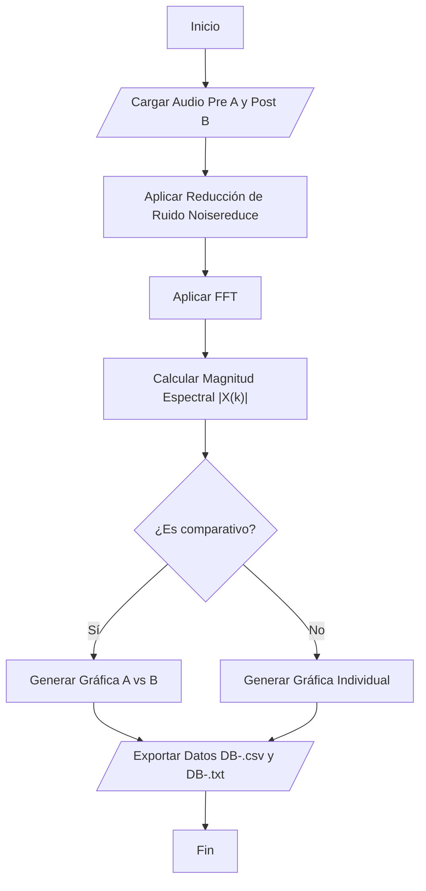

---

#### 2.2. Algoritmo 1.2.0: Rehabilitación por Amplificación Espectral

Descripción técnica:

Utilizando unicamente archivos pareados. El objetivo es igualar la respuesta en frecuencia de la señal post-cordectomía a la de la señal original. Se calcula un factor de ganancia $G(k)$ para cada banda de frecuencia $k$, tal que la magnitud post-cordectomía se aproxime a la pre-cordectomía.

$$G(k) = \frac{|X_{pre}(k)|}{|X_{post}(k)|}$$

La señal rehabilitada en el dominio de la frecuencia $Y_{reh}(k)$ se obtiene mediante:

$$Y_{reh}(k) = X_{post}(k) \cdot G(k)$$

Finalmente, se aplica la Transformada Inversa de Fourier (IFFT) para recuperar la señal de audio:

$$y(n) = \frac{1}{N} \sum_{k=0}^{N-1} Y_{reh}(k) e^{j \frac{2\pi}{N} k n}$$

Diagrama de flujo:

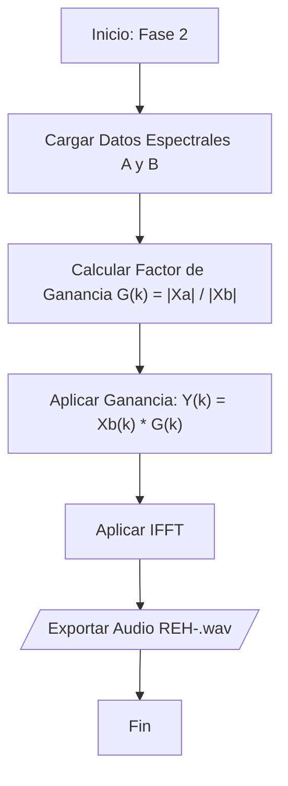

---

#### 2.3. Algoritmo 1.1.1: Procesamiento de Archivos Independientes

Descripción Técnica:

La iteración del Algoritmo 1.1.0 que permite el procesamiento de señales pre-cordectomía aisladas (sin reciproco post-cordectomía). Mantiene la estandarización en la generación de tablas de datos (`DB-`) y nomenclatura, facilitando la creación de bases de datos de referencia para análisis estadísticos posteriores.

Diagrama de flujo:

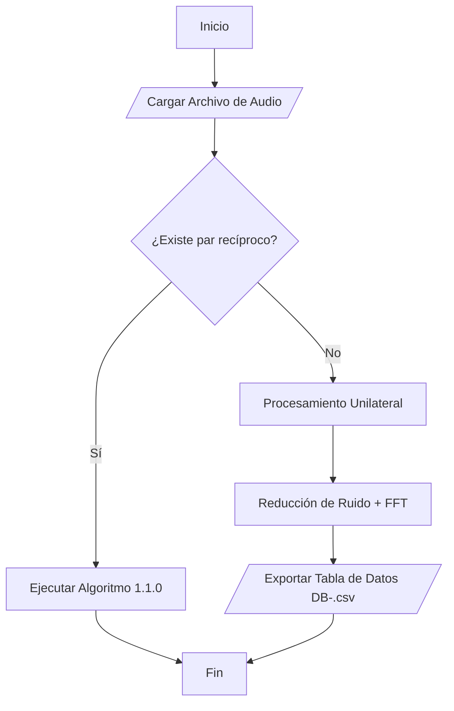

---

#### 2.4. Algoritmo 1.2.1: Rehabilitación por Suma Espectral Diferencial

Descripción técnica:

Este método se basa en la compensación aditiva. Se calculan los promedios espectrales de las muestras pre y post-cordectomía ($\mu_{pre}$ y $\mu_{post}$) para determinar la diferencia promedio $\Delta_{media}$.

$$\Delta_{media}(k) = \mu_{pre}(k) - \mu_{post}(k)$$

La reconstrucción se realiza sumando este diferencial al espectro objetivo antes de la IFFT:

$$|Y_{rehab}(k)| = |X_{post}(k)| + \Delta_{media}(k)$$

Diagrama de flujo:

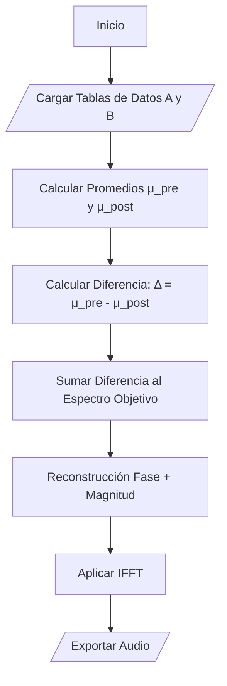

---

#### 2.5. Algoritmo 1.2.2: Rehabilitación por Inyección Proyectada (Desviación Estándar)

Descripción técnica:

Este algoritmo introduce un control estadístico para evitar la sobreamplificación artificial (clipping o distorsión). Se utilizan la media ($\mu$) y la desviación estándar ($\sigma$) de cada banda de frecuencia.

Se define una "Inyección Proyectada" ($I_{proyectada}$) basada en el margen existente entre el límite superior de la señal patológica ($\mu_{post} + 1/2\sigma_{post}$) y el límite inferior de la señal sana ($\mu_{pre} - 1/2\sigma_{pre}$).

El factor de amplificación corregido $G_{corr}$ se calcula como:

$$G_{correccion}(k) = \frac{|X_{post}(k)| + I_{proyectada}(k)}{\mu_{pre}(k)}$$

Donde el objetivo es que la señal resultante no exceda el umbral natural de la voz del paciente ($\mu_{pre}$). Posteriormente, se aplica la IFFT.

Diagrama de flujo:

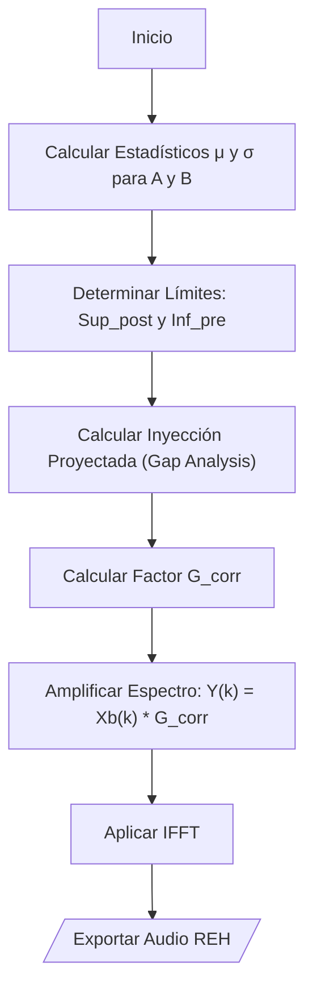

---

### 3. Conclusiones (v1.0)

---
El fallo crítico de esta versión radica en no haber considerado las alteraciones anatómicas derivadas de la intervención quirúrgica ni la severa degradación del contenido armónico. En la primera versión, debido a la escasa información vocal y a una baja Relación Señal-Ruido (SNR), la amplificación global elevó el "piso de ruido" presente en los periodos de silencio. Esto resultó en una señal con mayor ganancia, pero que conservaba la proporción desfavorable entre ruido y voz.

Asimismo, la aplicación indiscriminada de un factor de ganancia afecta a todos los componentes del audio por igual. Por tanto, resulta imperativo garantizar que los datos de entrada correspondan, en su totalidad o en su gran mayoría, a información vocal aislada.

Si bien la inyección de bandas de frecuencia mitigó parcialmente los artefactos metálicos, estos permanecieron perceptibles. Se atribuye esta persistencia a la interacción entre la información sintética inyectada y el ruido residual que no pudo ser eliminado eficazmente.

En la evaluación cualitativa final, el audio resultante no evidenció mejoras significativas: el tono se mantiene monocromático y excesivamente grave, careciendo de calidad tímbrica. Además, la voz se percibe con una textura robótica y los artefactos metálicos persistente.

---

## Versión 2.0: Optimización mediante Metadatos y Reconstrucción Estadística Ponderada

---

### 1. Generalidades y Protocolo de Adquisición

En esta iteración, se refina el protocolo de nomenclatura para incluir metadatos críticos que condicionan el procesamiento posterior, lo cual permite una aplicación más agresiva de los filtros de reducción de ruido. Se incorpora una evaluación cualitativa del ruido de fondo, realizada mediante monitoreo con audífonos _In-Ear Monitor_ (KZ ZSN Pro) para garantizar la fidelidad de la clasificación.

#### 1.1. Nomenclatura Estructurada

La estructura de los archivos evoluciona para integrar variables de género y calidad de la señal (Relación Señal-Ruido estimada). El esquema se define como:

`{CódigoPaciente}-{Género}{ID}.{Extensión}`

Definición de Metadatos:

- Código del paciente: Iniciales del sujeto.
- Género: Parámetro para ajuste de filtros de paso de banda.

  - `M`: Masculino.
  - `F`: Femenino.
  - `N`: Neutro.

- Origen y Calidad ($Q$):** Se concatena el indicador de origen (`A`: Pre-cordectomía, `B`: Post-cordectomía) repitiéndose $n$ veces según el nivel de ruido percibido.

  - $n=1$ (`A`): Calidad Alta / Ruido Bajo.
  - $n=2$ (`AA`): Calidad Media / Ruido Moderado.
  - $n=3$ (`AAA`): Calidad Baja / Ruido Alto.

- Para los audios post-cordectomia, el prefijo numérico`0` denota ausencia de su par recíproco pre-cordectomía.

Ejemplo: GFA-MBBB013.opus

> Interpretación: Paciente GFA, género Masculino (`M`), archivo de origen: Post-cordectomía (`B`) con nivel de ruido alto (iteración `3`), prefijo `0`: no existe par reciproco, identificador 13, formato `opus`.

---

### 2. Descripción de Algoritmos (v2.0)

---

#### 2.1. Algoritmo 2.1.0: Importación Adaptativa y Filtrado Selectivo

Descripción Técnica:

Este módulo implementa un sistema de análisis sintáctico mediante Expresiones Regulares (REGEX) para extraer los metadatos del nombre del archivo y configurar dinámicamente los parámetros del procesamiento digital de señales (DSP).

Se define un filtro paso banda $H(f)$ ajustado a las características fisiológicas del tracto vocal según el género:

- Masculino: $70 \text{ Hz} \le f \le 7000 \text{ Hz}$
- Femenino: $100 \text{ Hz} \le f \le 8000 \text{ Hz}$
- Neutro: $65 \text{ Hz} \le f \le 8000 \text{ Hz}$

Posteriormente, se aplica un algoritmo de reducción de ruido espectral (librería `noisereduce`) cuyos parámetros se ajustan según la calidad ($Q$) detectada del nombre del archivo:

|Nivel (Q)|prop_decrease|n_std_thresh|time_constant|Objetivo del Procesamiento|
|---|---|---|---|---|
|1 (A/B)|0.60|2.0|0.5 s|Conservación de textura natural y "aire".|
|2 (AA/BB)|0.90|1.5|2.0 s|Eliminación de ruido estacionario moderado.|
|3 (AAA/BBB)|0.90|1.5|1.0 s|Supresión agresiva. Prioriza la inteligibilidad sobre la naturalidad.|

Diagrama de Flujo:

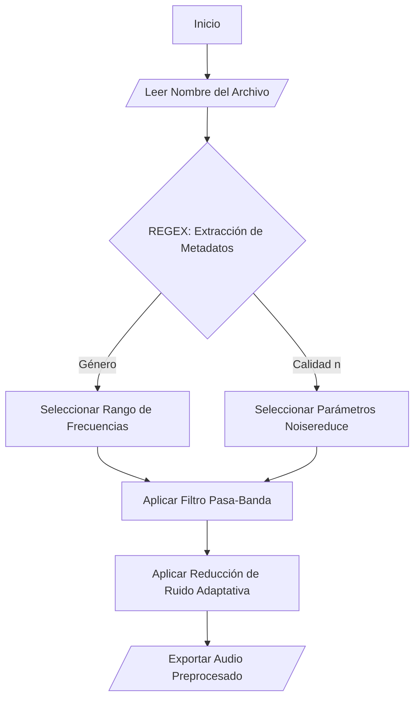

---

#### 2.2. Algoritmo 2.2.1.0: Generación del Modelo Espectral Ponderado (Entrenamiento)

Descripción técnica:

Este algoritmo tiene como objetivo construir un "Perfil Espectral Ideal" ($S_{ideal}$) a partir del conjunto de datos pre-cordectomía. Dado que la calidad de las grabaciones varía, se implementa un promedio ponderado donde los archivos con menor ruido tienen mayor influencia en el modelo resultante.

Se asignan los siguientes "pesos" ($w$) basados en la longitud de la cadena de calidad:

- Calidad Alta ($n=1$): $w = 10$
- Calidad Media ($n=2$): $w = 2$
- Calidad Baja ($n=3$): $w = 0.3$

El perfil espectral ideal para cada banda de frecuencia $k$ se calcula mediante:

$$S_{ideal}(k) = \frac{\sum_{i=1}^{N} (X_i(k) \cdot w_i)}{\sum_{i=1}^{N} w_i}$$

Donde $X_i(k)$ es la magnitud espectral del archivo $i$-ésimo y $w_i$ su peso correspondiente. Esto asegura que la reconstrucción se base en las señales más limpias, utilizando las señales ruidosas únicamente para corroborar tendencias estadísticas.

Diagrama de flujo:

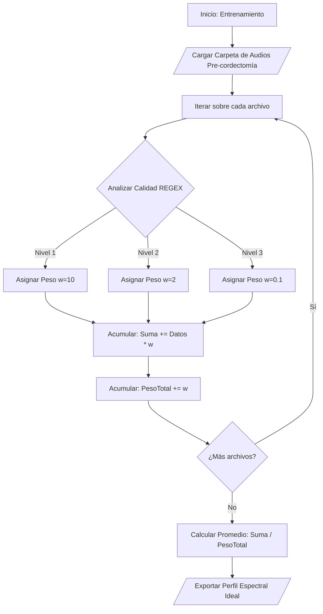

---

#### 2.3. Algoritmo 2.2.2.0: Reconstrucción Híbrida y Suavizado

Descripción técnica:

La fase final de rehabilitación utiliza un enfoque híbrido que divide el espectro en bandas funcionales para aplicar tratamientos diferenciados:

1. Banda Media (500 - 2500 Hz): Se considera la región con mayor información armónica remanente en el paciente. Se aplica una amplificación selectiva para proyectar la energía hacia la octava objetivo.
2. Banda Alta (3500 - 4500 Hz): Debido a la pérdida severa de información en altas frecuencias post-cordectomía, se realiza una "Sustitución Espectral". Los valores de magnitud en este rango son reemplazados por los valores correspondientes del $S_{ideal}$ obtenido en la fase de entrenamiento.

Finalmente, para evitar discontinuidades abruptas generadas por la sustitución artificial, se aplica un filtro de suavizado Savitzky-Golay sobre el espectro resultante antes de aplicar la Transformada Inversa de Fourier (IFFT).

$$Y_{reh}(k) = \text{SavGol}\left( \begin{cases} X_{post}(k) \cdot G_{amp} & \text{si } 500 \le f \le 2500 \\ S_{ideal}(k) & \text{si } 3500 \le f \le 4500 \\ X_{post}(k) & \text{resto} \end{cases} \right)$$

Diagrama de flujo:

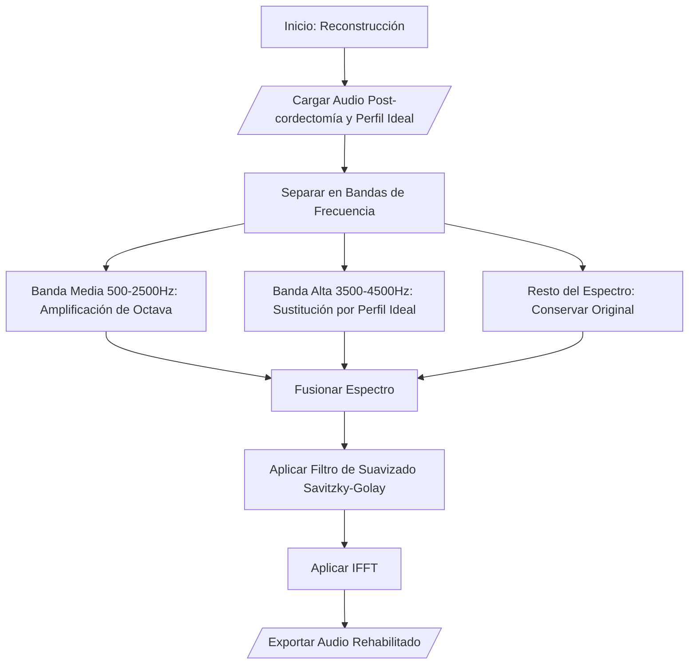

---

### 3. Conclusiones (v2.0)

---

Esta versión intentó solucionar el problema de la calidad mediante la creación de un "Perfil Ideal" ponderado y la inyección de armónicos artificiales. Sin embargo, fracasa al nuevamente intentar "estandarizar" la identidad de la voz que es más compleja.

El error fundamental de esta versión radica en tratar la voz como una señal estacionaria (constante en el tiempo). Al aplicar una Transformada de Fourier (FFT) sobre la totalidad del archivo y promediar los espectros, se pierde completamente la dimensión temporal.

La inyección de una banda de frecuencias artificial funciona matemáticamente para rellenar huecos, pero acústicamente es como intentar reemplazar la cuerda rota de una guitarra con una cuerda de piano. Aunque la nota sea la misma, el timbre no coincide, creando una voz que suena "metálica" o procesada, perdiendo identidad del paciente.

---

## Versión 3.0: Estimación Espectral MMSE y Enmascaramiento Adaptativo

---

### 1. Implementación y Estrategia de Procesamiento

Esta fase se centra en la optimización de señales pre-cordectomía de alta fidelidad, donde el ruido presente es predominantemente estacionario y periódico. A diferencia de las iteraciones anteriores, se ha desacoplado el módulo de reducción de ruido, estableciéndolo como un proceso independiente para garantizar la integridad de la señal antes de la extracción de sus características y la generación de los recursos gráficos.

Se ha sustituido la Transformada Rápida de Fourier (FFT) por la Transformada de Fourier de Tiempo Corto (STFT). Esto es fundamental dado que la voz es una señal no estacionaria; su contenido espectral varía en el tiempo. La STFT permite analizar la señal en ventanas temporales ($m$) y bandas de frecuencia ($k$):

$$X(m, k) = \sum_{n=0}^{N-1} x(n + mH) w(n) e^{-j \frac{2\pi}{N} kn}$$

Donde $w(n)$ es la función de ventana (ej. Hann o Hamming) y $H$ es el tamaño del salto (_hop size_).

#### Protocolo de Visualización y Nomenclatura

Para profundizar en el análisis cualitativo, se introduce la generación de espectrogramas comparativos, permitiendo visualizar la energía espectral en función del tiempo.

- Prefijo de Reporte: `ESP-` (Espectrograma).
 	- Identificador Comparativo: Se mantiene la identificación comparativa mediante la estructura `{Código del paciente}{(ID1-ID2)}`.

- Simplificación de Nomenclatura: Dado el enfoque en archivos de alta calidad y la eliminación de la librería `noisereduce` (basada en sustracción espectral simple), se revierten las reglas de la Versión 2.0, limitando el procesamiento a archivos que cumplan con los estándares de relación señal-ruido (SNR) adecuados.

---

### 2. Descripción de Algoritmos (v3.0)

---

#### 2.1. Algoritmo 3.1.0: Reducción de Ruido MMSE-STSA con VAD

Descripción técnica:

Este módulo implementa el estimador de Amplitud Espectral de Mínimo Error Cuadrático Medio (MMSE-STSA) basado en el algoritmo de Ephraim-Malah. A diferencia de la sustracción espectral simple, este método minimiza el error de estimación de la amplitud espectral de la voz bajo un modelo estadístico gaussiano.

Se integra un sistema de Detección de Actividad de Voz (VAD). El VAD actúa como una compuerta lógica que clasifica cada trama $m$ en dos estados: $H_0$ (ausencia de voz) y $H_1$ (presencia de voz).

- Estado $H_0$ (Silencio/Ruido): Se aplica una atenuación máxima o supresión total.
- Estado $H_1$ (Voz): Se calcula la ganancia óptima $G(k)$ basada en la SNR a priori y a posteriori.

Diagrama de flujo:

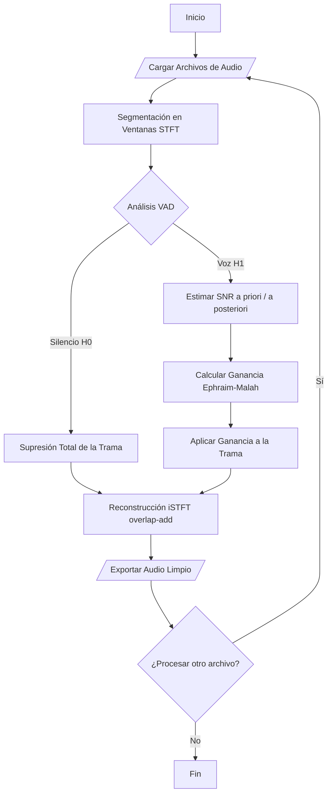

---

#### 2.2. Algoritmo 3.2.0: Extracción de Características y Visualización

Descripción técnica:

Este algoritmo implementa una búsqueda recursiva en el árbol de directorios para indexar los activos de audio disponibles. Permite la selección flexible de archivos (individuales o pares pareados) para la generación de reportes técnicos.

El producto principal es el espectrograma, calculado como la magnitud cuadrada de la STFT en escala logarítmica:

$$S(m, k) = 10 \cdot \log_{10}(|X(m, k)|^2)$$

Esto permite inspeccionar visualmente la estructura de los formantes y la efectividad de la limpieza de ruido en las bandas de frecuencia a lo largo del tiempo.

Diagrama de flujo:

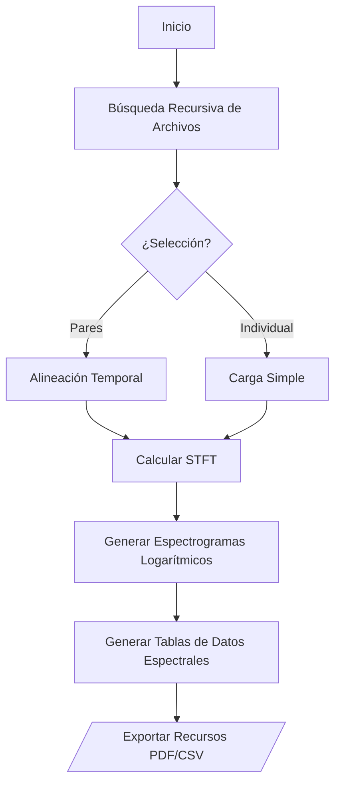

---

#### 2.3. Algoritmo 3.3.0: Rehabilitación por Máscara de Transferencia Espectral

Descripción técnica:

Este algoritmo genera un "Perfil de Usuario" promediando las curvas espectrales de las bases de datos pre y post-cordectomía, suavizadas previamente mediante un filtro Savitzky-Golay para eliminar ruido aleatorio de las curvas de tendencia.

Definimos la Función de Transferencia Objetivo ($T_{dB}$) como:

$$T_{dB}(k) = \mu_{PRE, dB}(k) - \mu_{POST, dB}(k)$$

Este valor representa la ganancia necesaria en cada banda $k$ para igualar la energía de la voz patológica a la voz sana.

Al procesar el audio objetivo, si las frecuencias de muestreo difieren, se aplica una interpolación lineal a $T_{dB}(k)$ para ajustar la resolución en frecuencia. Finalmente, la reconstrucción se realiza en el dominio lineal:

$$|Y_{reh}(m, k)| = |X_{post}(m, k)| \cdot 10^{\frac{T_{dB}(k)}{20}}$$

Posteriormente se aplica la Transformada Inversa de Fourier de Tiempo Corto (iSTFT) para recuperar la señal en el dominio del tiempo.

Diagrama de flujo:

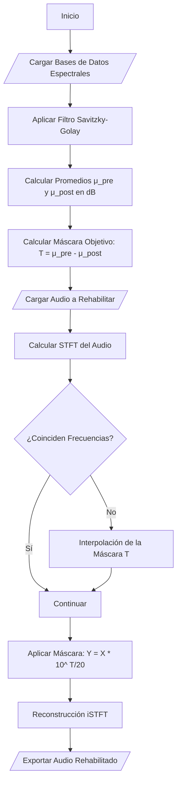

---

### 3. Conclusiones (v3.0)

---

Este método intenta reconstruir la "canción"  de la voz promediando todas las notas tocadas en una sola "super-nota" gigante. Pero, no es posible distinguir entre una vocal "A" y una consonante "S"; simplemente amplifica las frecuencias promedio de una manera aleatorio.

Si el paciente pronuncia una sílaba milisegundos más rápido o lento en la versión post-cordectomía que en la versión original, el ajuste espectral intentará corregir una "S" usando la información de una "A".

Al promediar múltiples archivos para crear el $S_{ideal}$ y aplicar filtros como Savitzky-Golay, se eliminan las micro-variaciones necesarias para dar "textura" y humanidad a la voz.

El audio resultante es "ronco", monocromático y carece de articulación, ya que se aplica la misma curva de ecualización a sonidos que físicamente requieren configuraciones del tracto vocal únicas para cada situación.

---

## Versión 4.0: Implementación de Inteligencia Artificial (Propuesta)

---

### 1. Generalidades

Para esta versión, se sustituye el procesamiento digital de señales "sustractivo" (filtrado de ruido y perfiles espectrales) para adoptar un enfoque potenciado por la inteligencia artificial enfocado a la generación sintética. La premisa principal de la Versión 4.0 es que la patología vocal no es "ruido" que debe eliminarse o sonidos que deben amplificarse, sino una característica que debe ser deconstruida; extraer su contenido lingüístico y re-sintetizarla con la forma deseada.

Para abordar la complejidad del habla; calidad de la voz vs. latencia (resultados en tiempo real) vs. expresividad/emociones del hablante, el desarrollo se dividió en cuatro fases. Cada fase aborda una limitación específica de las versiones anteriores, pasando del procesamiento _offline_ de alta fidelidad a la ejecución en tiempo real.

---

### 2. Descripción de Algoritmos (v4.0 - Propuesta)

---

#### 2.1. Fase 1: Reconstrucción y Síntesis de Alta Fidelidad (Offline)

Fundamento teórico:

Esta fase resuelve el problema de la "alineación temporal" mediante una arquitectura ASR-TTS (Automatic Speech Recognition $\to$ Text-to-Speech).

El sistema desacopla totalmente la señal de entrada. Utiliza un modelo de reconocimiento robusto (ej. Whisper) para extraer los "tokens semánticos" (el texto/mensaje), descartando cualquier información acústica patológica (ronquera, falta de aire). Posteriormente, un modelo de síntesis (ej. XTTS v2) condicionada por un Speaker Embedding (vector latente extraído de los audios pre-cordectomía) genera una onda sonora completamente nueva.

Matemáticamente, buscamos maximizar la probabilidad de la onda de salida $Y$ dado el texto transcrito $T$ y el vector de identidad del hablante $S$:

$$P(Y | T, S) = \prod_{n} P(y_n | y_{<n}, T, S)$$

Expectativa:

- Calidad: Máxima posible. Eliminación del 100% de los artefactos de la cordectomía. La voz sonará limpia y sana.
- Latencia: Alta (No apto para tiempo real).
- Limitación: Se pierde la prosodia original (ritmo y entonación) del paciente al momento de grabar, reemplazándola por una prosodia "neutra" generada por la IA.

Diagrama de flujo (propuesta):

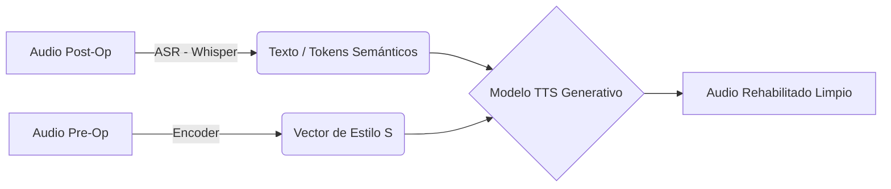

---

#### 2.2. Algoritmo 4.2.0: Optimización de Preferencias (Fase 2)

Fundamento teórico:

Dado que la Fase 1 produce una voz "neutra", esta fase introduce un algoritmo de Entrenamiento Supervisado por Preferencias. Se basa en principios de Reinforcement Learning from Human Feedback (RLHF) simplificado o selección de vectores de estilo.

El sistema genera $N$ variaciones de una misma frase modificando los hiperparámetros del espacio latente (temperatura, velocidad, pitch). El paciente realiza una prueba A/B, y el sistema ajusta los pesos o selecciona el "centroide" del vector de estilo que mejor representa la identidad percibidla por el usuario para diferentes contextos (Familiar, Profesional, Emocional).

Expectativa:

- Resultado: Creación de una biblioteca de "Presets de Identidad".
- Interacción: El paciente recupera control sobre su expresión, pudiendo elegir si quiere sonar "serio" o "feliz", algo imposible con filtros DSP tradicionales.

- Diagrama de flujo (propuesta)

```
graph TD
    A[Inicio: Texto de Calibración] --> B[/Cargar Identidad Pre-Op Vector S/]
    B --> C{Generador de Variaciones}
    
    subgraph "Exploración del Espacio Latente"
    C -->|Var: Pitch/Velocidad| D[Generar Audio Opción A]
    C -->|Var: Entonación/Timbre| E[Generar Audio Opción B]
    end
    
    D --> F{Selección del Paciente}
    E --> F
    
    F -- "Prefiero A" --> G[Ajustar Centroide hacia A]
    F -- "Prefiero B" --> H[Ajustar Centroide hacia B]
    F -- "Ninguna" --> C
    
    G --> I{¿Satisfecho?}
    H --> I
    
    I -- No (Refinar) --> C
    I -- Sí --> J[Guardar Vector de Estilo Optimizado]
    J --> K[(Base de Datos de Perfiles: Familiar, Serio, etc.)]
```

---

#### 2.3. Fase 3: Conversión de Voz por Streaming de Baja Latencia

Fundamento teórico:

Para lograr la comunicación en tiempo real ("Efecto Micrófono"), se elimina el paso intermedio de conversión a texto. Se implementa una arquitectura RVC (Retrieval-based Voice Conversion) o So-VITS-SVC.

El fundamento es el "Information Bottleneck" (Cuello de botella de información). Una red neuronal (ej. HuBERT o ContentVec) comprime el audio post-op en "unidades de contenido" de baja resolución, perdiendo el ruido de la patología en el proceso.

Simultáneamente, se implementa un Predictor de F0 (Pitch) Plano/Suavizado. En lugar de copiar el tono errático de la voz esofágica, la IA inyecta una curva de entonación estable antes de que el Vocoder (ej. HiFi-GAN) reconstruya el audio.

$$Y_{stream} = Dec(Content(X_{post}), F0_{smooth}, S_{pre})$$

Expectativa:

- Latencia: < 100ms (percibido como casi instantáneo con hardware adecuado).
- Calidad: Ligeramente inferior a la Fase 1, pero superior a cualquier filtro MMSE (v3.0).
- Estabilidad: La voz será monotónica pero inteligible y libre de quiebres, ideal para llamadas telefónicas o conversaciones fluidas.

Diagrama de flujo (propuesta):

```
graph TD
    A[Entrada Micrófono: Voz Post-Op] --> B[Buffer Circular / Chunking 40ms]
    B --> C[Encoder: ContentVec / HuBERT]
    
    subgraph "Cuello de Botella de Información"
    C -->|Unidades Semánticas| D[Descarte de Ruido y Timbre Original]
    end
    
    B --> E[Extractor de Pitch F0]
    E --> F{Modulador de F0}
    F -- Ignorar F0 Real --> G[Generar Curva F0 Plana/Neutra]
    
    D --> H[Decoder / Vocoder HiFi-GAN]
    G --> H
    H -->|Condicionado por| I[/Perfil de Estilo Pre-Op Fase 2/]
    
    H --> J[Overlap-Add: Reconstrucción de Flujo]
    J --> K[Salida Altavoz]
```

---

#### 2.4. Fase 4: Modulación Emocional Dinámica en Tiempo Real

Fundamento teórico:

Esta es la fase de integración final. Se añade un módulo paralelo de Reconocimiento de Emociones en el Habla (SER - Speech Emotion Recognition) de baja latencia.

Este módulo analiza características suprasegmentales (volumen, ritmo relativo) de la voz post-op para inferir la intención emocional, a pesar de la patología. Esta inferencia se modula dinámicamente el Vector de Estilo utilizado en la Fase 3.

Expectativa:

- Un sistema orgánico. Si el paciente intenta gritar o hablar rápido (excitación), la voz sintética aumentará su volumen y cambiará el timbre acorde a los perfiles definidos en la Fase 2.
- Desafío: Alta complejidad computacional y riesgo de "alucinaciones emocionales" (que la IA interprete un jadeo por falta de aire como una expresión de sorpresa). Requiere un ajuste fino (Fine-tuning) muy agresivo.

Diagrama de flujo (propuesta):

```
graph TD
    A[Entrada Micrófono] --> B[Extracción de Contenido ContentVec]
    A --> C[Detector de Intención/Emoción]
    D[Base de Datos: Vectores de Estilo] --> C
    B --> E{Generador VITS/RVC}
    C -->|Modulación del Vector| E
    E --> F[Salida Altavoz Tiempo Real]
```

---

# Conclusiones generales

---

La evolución del proyecto, desde la implementación de análisis espectrales estáticos hasta la adopción de modelos como Ephraim-Malah y la transformada de tiempo corto (STFT), permite establecer una serie de hallazgos críticos sobre la naturaleza del procesamiento digital de señales aplicado a la rehabilitación vocal.

En primer lugar, la aproximación al problema ha revelado que la voz humana no puede tratarse como un fenómeno estático monotónico, sino que debe comprenderse bajo una analogía armónica compleja, similar a la ejecución de una pieza de guitarra. Si bien la "tonalidad" general (frecuencia fundamental) puede mantenerse, la riqueza de la información reside en la superposición dinámica de armónicos y formantes que varían milimétricamente con cada fonema. Se concluye que las técnicas de procesamiento global —que aplican una ecualización estática a todo el archivo— resultan insuficientes para capturar la esencia de la articulación vocal-consonante. El éxito de la rehabilitación espectral depende, por tanto, de la capacidad de descomponer y ajustar la señal en una escala temporal micro-segmentada, atendiendo a la "ejecución de cada acorde" fonético y no solo al promedio de la obra.

En cuanto a la reducción de ruido, se evidenció una dicotomía técnica entre la limpieza de la señal y la fidelidad tímbrica. Si bien los algoritmos de sustracción espectral y filtrado de Wiener+VAD logran atenuar significativamente la contaminación estacionaria, estan limitados a archivos cuyo ruido estacionario sea consistente. Además, la presencia de transitorios no estacionarios (ruidos repentinos) expuso las limitaciones de la STFT, sugiriendo que futuras experimenta deberían explorar el uso de la Transformada Wavelet, cuya propiedad es superior para tratar irregularidades temporales y esporádicas.

Un hallazgo fundamental en el análisis pareado (Pre vs. Post cordectomía) fue la criticidad de la alineación temporal. Aunque se logró una aproximación general a la prosodia, se demostró que cualquier desviación rítmica entre la grabación original y la simulación patológica resulta catastrófica en el dominio del tiempo. Al reconstruir la señal, el desfase entre las bandas de frecuencia y la intención articulatoria original genera incoherencias de fase, produciendo sonidos sintéticos o inexactos. Esto subraya la necesidad de implementar algoritmos de alineación elástica temporal (_Dynamic Time Warping_) antes de cualquier operación de sustracción o transferencia espectral.

Finalmente, aunque el marco teórico actual sugiere la viabilidad de la rehabilitación por transferencia espectral, la complejidad anatómica observada —donde estructuras geométricas simples como la laringe generan bandas de frecuencia de alta complejidad— demanda herramientas computacionales más sofisticadas. El futuro de esta investigación apunta hacia la caracterización multidimensional a nivel silábico, empleando tensores y matrices de mayores dimensiones que permitan aislar, modelar y reconstruir la voz no como un flujo continuo, sino como una secuencia discreta de eventos acústicos únicos.

---

# Referencias IEEE, cont

---
[1] T. E. Oliphant, "A guide to NumPy," USA: Trelgol Publishing, vol. 1, 2006.

[2] W. McKinney, "Python for data analysis: Data wrangling with Pandas, NumPy, and IPython," O'Reilly Media, Inc., 2012.

[3] S. van der Walt, S. C. Colbert, and G. Varoquaux, "The NumPy array: A structure for efficient numerical computation," _Computing in Science & Engineering_, vol. 13, no. 2, pp. 22-30, 2011.

[4] J. M. Kizza, "Python for scientific computing," in _Guide to Computer Network Security_, Springer, 2017, pp. 263-283.

[5] P. Virtanen et al., "SciPy 1.0: fundamental algorithms for scientific computing in Python," _Nature Methods_, vol. 17, no. 3, pp. 261-272, 2020.

[6] E. Jones, T. Oliphant, and P. Peterson, "SciPy: Open source scientific tools for Python," 2001.

[7] A. Savitzky and M. J. E. Golay, "Smoothing and differentiation of data by simplified least squares procedures," _Analytical Chemistry_, vol. 36, no. 8, pp. 1627-1639, 1964.

[8] R. W. Schafer, "What is a Savitzky-Golay filter? [lecture notes]," _IEEE Signal Processing Magazine_, vol. 28, no. 4, pp. 111-117, 2011.

[9] W. H. Press and S. A. Teukolsky, "Savitzky-Golay smoothing filters," _Computers in Physics_, vol. 4, no. 6, pp. 669-672, 1990.

[10] M. Schmid, D. Rath, and U. Diebold, "Why and how Savitzky–Golay filters should be replaced," _ACS Measurement Science Au_, vol. 2, no. 2, pp. 185-196, 2022.

[11] H. H. Madden, "Comments on the Savitzky-Golay convolution method for least-squares-fit smoothing and differentiation of digital data," _Analytical Chemistry_, vol. 50, no. 9, pp. 1383-1386, 1978.

[12] J. O. Smith, "Spectral audio signal processing," W3K Publishing, 2011.

[13] L. R. Rabiner and B. Gold, "Theory and application of digital signal processing," Englewood Cliffs, NJ: Prentice-Hall, Inc., 1975.

[14] J. B. Allen and L. R. Rabiner, "A unified approach to short-time Fourier analysis and synthesis," _Proceedings of the IEEE_, vol. 65, no. 11, pp. 1558-1564, 1977.

[15] M. R. Portnoff, "Time-frequency representation of digital signals and systems based on short-time Fourier analysis," _IEEE Transactions on Acoustics, Speech, and Signal Processing_, vol. 28, no. 1, pp. 55-69, 1980.

[16] M. Dolson, "The phase vocoder: A tutorial," _Computer Music Journal_, vol. 10, no. 4, pp. 14-27, 1986.

[17] D. Griffin and J. Lim, "Signal estimation from modified short-time Fourier transform," _IEEE Transactions on Acoustics, Speech, and Signal Processing_, vol. 32, no. 2, pp. 236-243, 1984.

[18] B. Sharpe, "Invertibility of overlap-add processing," <https://gauss256.github.io/blog/cola.html>, accessed July 2019.

[19] L. R. Rabiner and R. W. Schafer, "Digital processing of speech signals," Englewood Cliffs, NJ: Prentice Hall, 1978.

[20] Y. Ephraim and D. Malah, "Speech enhancement using a minimum-mean square error short-time spectral amplitude estimator," _IEEE Transactions on Acoustics, Speech, and Signal Processing_, vol. 32, no. 6, pp. 1109-1121, 1984.

[21] N. Wiener, "Extrapolation, interpolation, and smoothing of stationary time series: with engineering applications," MIT Press, 1949.

[22] J. Chen, J. Benesty, Y. Huang, and S. Doclo, "New insights into the noise reduction Wiener filter," _IEEE Transactions on Audio, Speech, and Language Processing_, vol. 14, no. 4, pp. 1218-1234, 2006.

[23] P. C. Loizou, "Speech enhancement: theory and practice," CRC Press, 2013.

[24] S. F. Boll, "Suppression of acoustic noise in speech using spectral subtraction," _IEEE Transactions on Acoustics, Speech, and Signal Processing_, vol. 27, no. 2, pp. 113-120, 1979.

[25] J. Sohn, N. S. Kim, and W. Sung, "A statistical model-based voice activity detection," _IEEE Signal Processing Letters_, vol. 6, no. 1, pp. 1-3, 1999.

[26] A. J. M. Houtsma, "Pitch and timbre: Definition, meaning and use," _Journal of New Music Research_, vol. 26, no. 2, pp. 104-115, 1997.

[27] H. M. Teager and S. M. Teager, "Evidence for nonlinear sound production mechanisms in the vocal tract," in _Speech Production and Speech Modelling_, Springer, 1990, pp. 241-261.

[28] P. Ladefoged, "Vowels and consonants: An introduction to the sounds of languages," Malden, MA: Blackwell Publishers, 2001.

[29] G. Fant, "Acoustic theory of speech production," The Hague: Mouton, 1960.

[30] G. E. Peterson and H. L. Barney, "Control methods used in a study of the vowels," _The Journal of the Acoustical Society of America_, vol. 24, no. 2, pp. 175-184, 1952.

[31] J. Hillenbrand, L. A. Getty, M. J. Clark, and K. Wheeler, "Acoustic characteristics of American English vowels," _The Journal of the Acoustical Society of America_, vol. 97, no. 5, pp. 3099-3111, 1995.

[32] K. N. Stevens, "Acoustic phonetics," MIT Press, 1998.

[33] D. H. Whalen and A. G. Levitt, "The universality of intrinsic F0 of vowels," _Journal of Phonetics_, vol. 23, no. 3, pp. 349-366, 1995.

[34] I. R. Titze, "Principles of voice production," Iowa City: National Center for Voice and Speech, 2000.

[35] M. Hirano, "Clinical examination of voice," Springer Science & Business Media, 2013.

[36] C. E. Silver, J. J. Beitler, A. R. Shaha, A. Rinaldo, and A. Ferlito, "Current trends in initial management of laryngeal cancer: the declining use of open surgery," _European Archives of Oto-Rhino-Laryngology_, vol. 266, no. 9, pp. 1333-1352, 2009.

[37] M. Remacle, G. Eckel, A. Antonelli, et al., "Endoscopic cordectomy. A proposal for a classification by the Working Committee, European Laryngological Society," _European Archives of Oto-Rhino-Laryngology_, vol. 257, no. 4, pp. 227-231, 2000.

[38] E. V. Sjögren, M. A. van Rossum, T. P. Langeveld, et al., "Voice outcome in T1a midcord glottic carcinoma: laser surgery vs radiotherapy," _Archives of Otolaryngology–Head & Neck Surgery_, vol. 134, no. 9, pp. 965-972, 2008.

[39] T. Yılmaz et al., "Voice after cordectomy type I or type II or radiation therapy for large T1a glottic cancer," _Otolaryngology–Head and Neck Surgery_, vol. 168, no. 3, pp. 559-568, 2023.

[40] L. M. Aaltonen et al., "Voice quality after treatment of early vocal cord cancer: a randomized controlled trial comparing laser surgery with radiation therapy," _International Journal of Radiation Oncology Biology Physics_, vol. 90, no. 2, pp. 255-270, 2014.

[41] H. S. Lee, J. S. Kim, S. W. Kim, et al., "Voice outcome according to surgical extent of transoral laser microsurgery for T1 glottic carcinoma," _The Laryngoscope_, vol. 126, no. 9, pp. 2051-2056, 2016.

[42] A. K. Fouad et al., "Laryngeal compensation for voice production after CO2 laser cordectomy," _Clinical and Experimental Otorhinolaryngology_, vol. 8, no. 4, pp. 340-346, 2015.

[43] G. Fant, "Acoustic theory of speech production: with calculations based on X-ray studies of Russian articulations," The Hague: Mouton, 1960.

[44] T. Chiba and M. Kajiyama, "The vowel: Its nature and structure," Tokyo-Kaiseikan Publishing Co., 1941.

[45] K. N. Stevens, "Acoustic phonetics," Current Studies in Linguistics Series, vol. 30, MIT Press, 1999.

[46] J. L. Flanagan, "Speech analysis synthesis and perception," Berlin: Springer-Verlag, 1972.

[47] I. R. Titze, "Nonlinear source-filter coupling in phonation: Theory," _The Journal of the Acoustical Society of America_, vol. 123, no. 5, pp. 2733-2749, 2008.

[48] P. Birkholz, D. Jackèl, and B. J. Kröger, "Construction and control of a three-dimensional vocal tract model," in _2006 IEEE International Conference on Acoustics Speech and Signal Processing Proceedings_, IEEE, vol. 1, 2006.

[49] B. H. Story, "A parametric model of the vocal tract area function for vowel and consonant simulation," _The Journal of the Acoustical Society of America_, vol. 117, no. 5, pp. 3231-3254, 2005.

[50] W. J. Hardcastle, J. Laver, and F. E. Gibbon, _The Handbook of Phonetic Sciences_, 2nd ed. Oxford: Wiley-Blackwell, 2010.

[51] I. Goodfellow, Y. Bengio, y A. Courville, _Deep Learning_. MIT Press, 2016.

[52] J. Wang, K. Chin, y H. Wang, "Speaker-informed speech enhancement and separation," en _Proc. IEEE Intl. Conf. on Acoustics, Speech and Signal Processing (ICASSP)_, 2021.

[53] Y. Fathullah _et al._, "Neural Speech Synthesis using Semantic Tokens," _arXiv preprint arXiv:2305.xxxx_, 2023.

[54] W.-N. Hsu, B. Bolte, Y.-H. H. Tsai, K. Lakhotia, R. Salakhutdinov, y A. Mohamed, "HuBERT: Self-Supervised Speech Representation Learning by Masked Prediction of Hidden Units," en _IEEE/ACM Transactions on Audio, Speech, and Language Processing_, vol. 29, pp. 3451-3460, 2021.

[55] K. Qian, Y. Zhang, H. Gao, J. Ni, C.-I. Lai, D. Cox, M. Hasegawa-Johnson, y S. Chang, "ContentVec: An Improved Self-Supervised Speech Representation by Disentangling Speakers," en _Proc. of the 39th International Conference on Machine Learning (ICML)_, 2022.

[56] N. Tishby y N. Zaslavsky, "Deep learning and the information bottleneck principle," en _IEEE Information Theory Workshop (ITW)_, 2015.

[57] X. Tan _et al._, "A Survey on Neural Speech Synthesis," _arXiv preprint arXiv:2106.15561_, 2021.

[58] RVC-Project, "Retrieval-based Voice Conversion WebUI," GitHub repository, 2023. [En línea].

[59] C. Kavin (svc-develop-team), "So-VITS-SVC: SoftVC VITS Singing Voice Conversion," GitHub repository, 2023. [En línea].

[60] E. Gölge _et al._, "Coqui XTTS: Open-Source Text-to-Speech Model," Coqui AI, 2023.

[61] A. Radford, J. W. Kim, T. Xu, G. Brockman, C. McLeavey, y I. Sutskever, "Robust Speech Recognition via Large-Scale Weak Supervision," _OpenAI Technical Report_, 2022.

[62] J. Kong, J. Kim, y J. Bae, "HiFi-GAN: Generative Adversarial Networks for Efficient and High Fidelity Speech Synthesis," en _Proc. NeurIPS_, 2020.

[63] P. Christiano _et al._, "Deep Reinforcement Learning from Human Feedback," _Advances in Neural Information Processing Systems_, 2017.

[64] R. A. Khalil _et al._, "Speech Emotion Recognition Using Deep Learning Techniques: A Review," _IEEE Access_, vol. 7, pp. 117327-117345, 2019.
